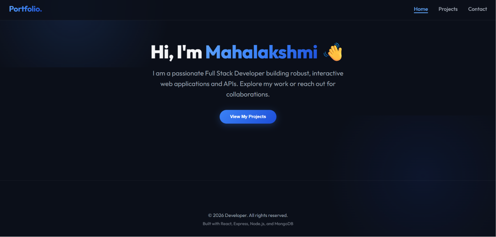
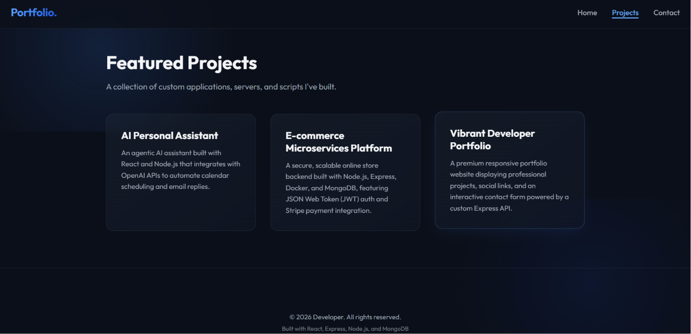
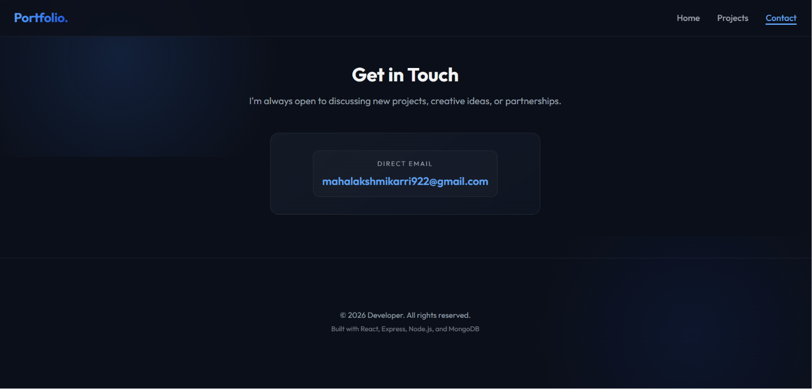

# Vibrant Full-Stack Developer Portfolio

A premium, responsive, modern developer portfolio website. The application features a React frontend client and an Express/Node.js backend server connecting to MongoDB to fetch and display personal projects.

---

## 🚀 Features

- **Premium UI Design**: A stunning modern dark-mode aesthetic utilizing the Google Font `Outfit`, glowing card accents, glassmorphic navigations, and smooth transition effects.
- **Dynamic Projects Showcase**: Fetches personal project lists dynamically from a MongoDB database via an Express REST API.
- **Graceful Error Handling**: Complete try/catch coverage on both client and server to keep the application running smoothly even when the database is offline.
- **Root Task Manager**: Concurrently runs both the client and server applications using a single unified command from the root directory.

---

## 📂 Project Structure

```text
├── client/                 # React frontend application
│   ├── public/             # Static public assets (HTML, favicon)
│   ├── src/                # React source code (components, pages, styles)
│   └── package.json        # Frontend dependencies
│
├── server/                 # Express backend API application
│   ├── .env.example        # Environment variable template
│   ├── seed.js             # Database seeder script
│   ├── server.js           # API entry point & mongoose models
│   └── package.json        # Backend dependencies
│
├── package.json            # Root manager scripts & concurrently setup
└── README.md               # Project documentation
```

---

## 🛠️ Installation & Setup

Ensure you have [Node.js](https://nodejs.org/) installed.

### 1. Install Dependencies
Run the installation command in the **root** directory to install all packages for both the client and server:
```bash
npm run install-all
```

### 2. Configure Environment Variables
Inside the `server/` directory, create a `.env` file (you can copy `.env.example`) and specify your MongoDB URI and port details:
```env
MONGODB_URI=mongodb+srv://<username>:<password>@cluster.mongodb.net/portfolio
PORT=5000
```

### 3. Seed initial database data
To populate your MongoDB database with sample developer projects, run:
```bash
npm run seed --prefix server
```

---

## 💻 Running the Application

To start both the **React Client** (port `3000`) and the **Express Server** (port `5000`) concurrently, run this single command in the **root** folder:

```bash
npm run dev
```

### Direct scripts:
- **`npm run dev`**: Starts both client and server concurrently.
- **`npm run install-all`**: Installs packages for both client and server folders.
- **`npm run client`**: Starts only the React development server.
- **`npm run server`**: Starts only the Express backend server.

---

## 🔗 Live Demo

- **Live Website**: [https://yourportfolio.vercel.app](https://yourportfolio.vercel.app)

---

## 📸 Screenshots

#### 1. Home Page (Hero Section)


#### 2. Featured Projects Grid (Dynamic database fetch)


#### 3. Get In Touch (Contact Page)


